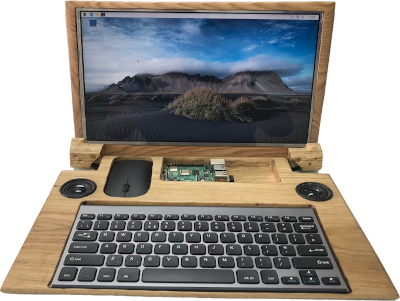
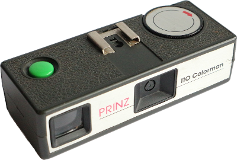

### Hi there 👋 I'm a self taught Python developer and I also create projects like these:

# OakPi
### Raspberry Pi 4 4Gb Laptop
Handmade out of 2 pieces of Oak timber and why not? Although it's not a monster powerful machine to use but it is perfectly fine for coding, excellent for use of the GPIO's and good enough to screen capture whilst coding with webcam use and stream live to my YouTube channel
[more information](https://raspipkr.github.io/martinparkers/11.html)

# piCamera
### 1970's Camera Upgrade to Digital with Bluetooth and Wifi with capabilty to email picture directly from shot
I kept the viewfinder intact and useable but can you believe there's a Raspberry Pi Zero W inside with a 5Mp camera, charge circuit and a LiPo battery?
Neither can I but I did and this sure is a compact camera
[more information](https://raspipkr.github.io/martinparkers/10.html)

If I have helped you out in some way and want to give some appreciation back feel free to check out my GitHub Sponsor page
<!--
**RasPiPkr/RasPiPkr** is a ✨ _special_ ✨ repository because its `README.md` (this file) appears on your GitHub profile.

Here are some ideas to get you started:

- 🔭 I’m currently working on ...
- 🌱 I’m currently learning ...
- 👯 I’m looking to collaborate on ...
- 🤔 I’m looking for help with ...
- 💬 Ask me about ...
- 📫 How to reach me: ...
- 😄 Pronouns: ...
- ⚡ Fun fact: ...
-->
