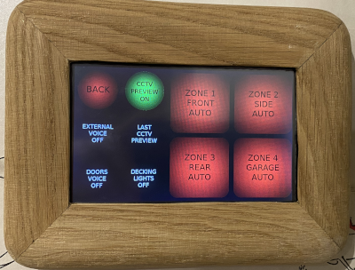

### Hi there 👋 I'm a self taught Python developer and I also create projects like these:

# OakPi - Raspberry Pi 4 4Gb Laptop
Handmade out of 2 pieces of Oak timber and why not? Although it's not a monster powerful machine to use but it is perfectly fine for coding, excellent for use of the GPIO's and good enough to screen capture whilst coding with webcam use and stream live to my YouTube channel and more information can be found via
[more information](https://raspipkr.github.io/martinparkers/11.html)

---
# Home Heating and Security Control
This controls my heating via a temperature sensor and a relay to control my central heating instead of my old thermostat. It also controls my security lights via relays and takes input via external PIR sensors. There are some additional features and more information can be found via
[myHome Repository](https://github.com/RasPiPkr/myHome)

If I have helped you out in some way and want to give some appreciation back feel free to check out my [GitHub Sponsor page](https://github.com/sponsors/RasPiPkr)
<!--
**RasPiPkr/RasPiPkr** is a ✨ _special_ ✨ repository because its `README.md` (this file) appears on your GitHub profile.

Here are some ideas to get you started:

- 🔭 I’m currently working on ...
- 🌱 I’m currently learning ...
- 👯 I’m looking to collaborate on ...
- 🤔 I’m looking for help with ...
- 💬 Ask me about ...
- 📫 How to reach me: ...
- 😄 Pronouns: ...
- ⚡ Fun fact: ...
-->
